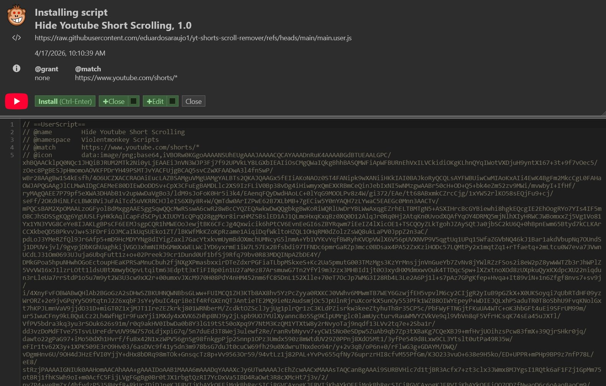
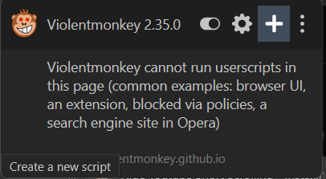

# How to Use

1. Install a UserScript manager:
   - Recommended: [ViolentMonkey](https://violentmonkey.github.io/)
   - Alternative: [TamperMonkey](https://www.tampermonkey.net) *(not tested)*

2. Open the script file in raw mode:  
   [main.user.js](https://raw.githubusercontent.com/eduardosaraujo1/yt-shorts-scroll-remover/refs/heads/main/main.user.js)

3. If your UserScript manager is installed correctly, an **Install** button should appear (see Figure 1). Click it to install the script.

---

## Manual Installation (if auto-install doesn’t work)

1. Select the entire script (`Ctrl+A` / `Cmd+A`) and copy it (`Ctrl+C` / `Cmd+C`)
2. Click the ViolentMonkey extension icon
3. Select **Create a new script** (see Figure 2)
4. Paste the script into the editor (`Ctrl+V` / `Cmd+V`)
5. Save (`Ctrl+S` / `Cmd+S`)

---

### Figure 1

### Figure 2

---

# Expected Behavior

When opening a YouTube Short:
- The current video plays normally
- Scrolling to the next suggested videos is disabled

---

# Troubleshooting & Feedback

If you encounter issues, please open a  
[GitHub Issue](https://github.com/eduardosaraujo1/yt-shorts-scroll-remover/issues/new/choose)

Include:
- Device (desktop/mobile)
- Browser and version
- Console logs (if possible)
